# PyBer Analysis

## Overview of the analysis

An analysis will be performed at PyBer which is a python based ride-sharing app.  
The task is to perform an exploratory analysis in large datasets regarding cities and rides and create several types of visualizations to tell a compelling story about the data. The tools that will be used are pandas, matplotlib and numpy.

Two datasets were provided, a dataset with 2375 rows and information about rides, their fares, date of the ride and city where the ride was made. 
Another dataset with 121 rows and information about cities, amount of drivers in each city and the type of city (urban,suburban,rural).

Using the pandas library the datasets were load and read and then we merged both datasets into a single dataframe.

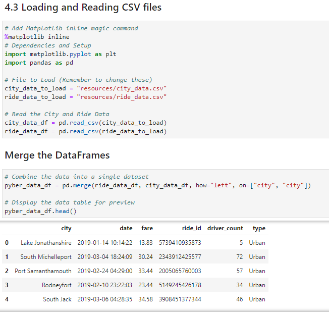

With the merged dataframe we obtained the information requested:
1. The total rides for each city type
2. The total drivers for each city type
3. The total amount of fares for each city type

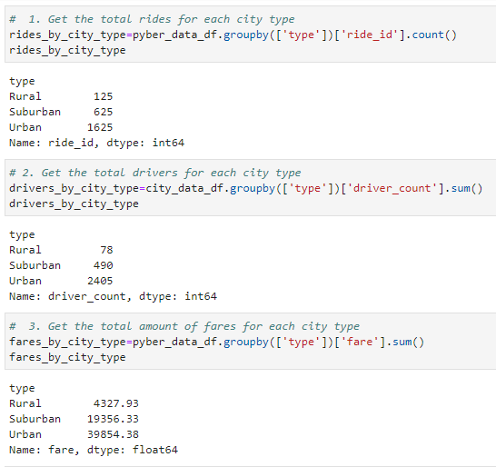

4. The average fare per ride for each city type
5. The average fare per driver for each city type 

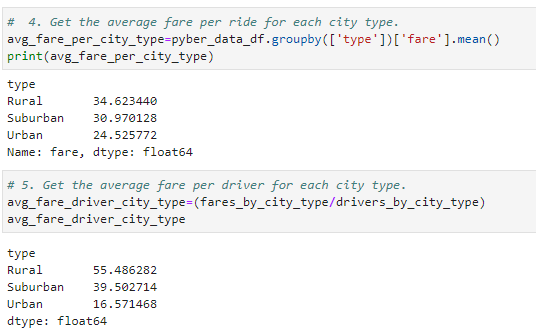

And then proceed to create a summary dataframe with the results obtained

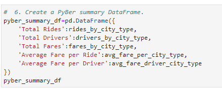

The first task was complete, then a multiple line chart was requested to see the behaviour of fares vs months between the three city types.

The original dataframe merged was used to perform this chart. A groupby() was used to group by the columns 'type' and 'date' and to obtain the sum of fares.

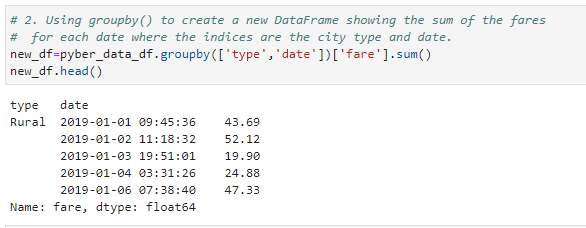

We needed to set only the date as the index for this table, therefore, first we reset the index and then assign a new index with the pivot function.

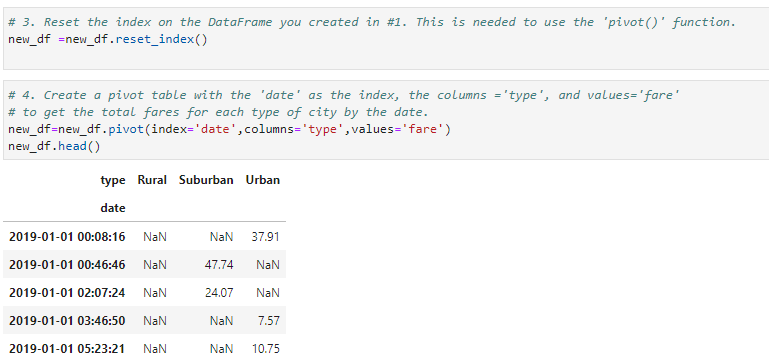

A new dataframe was created with a range of dates. To this new dataframe we have to set the index as 'DatetimeIndex' datatype since the index is 'Index' datatype. This is necessary because we'll be using the resample method to stablish weeks instead of days for the DatetimeIndex.

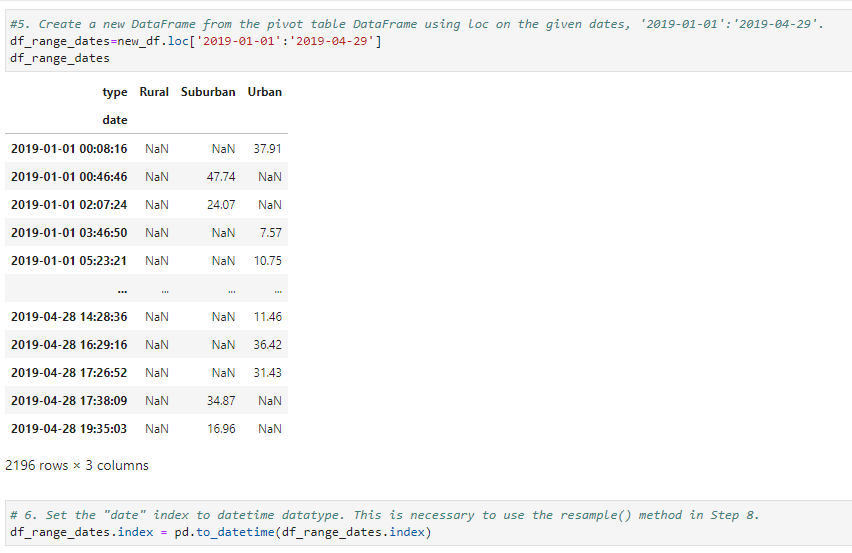

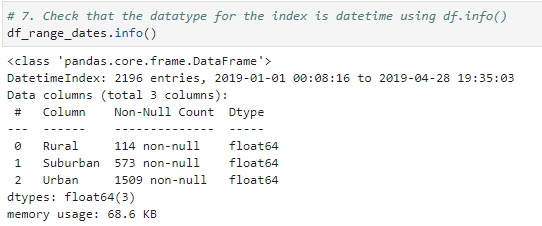

The resample method is used and then we sum the fares for each city type to resume the information.

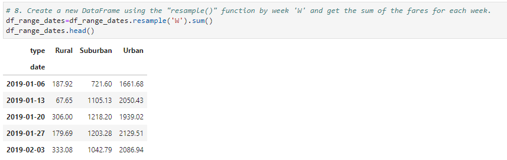

To have a better undestanding regarding the results obtained, a multiple line chart was created in order to compare the behaviour between the three city types regarding fares vs date.  
To create this chart the datetime and matplotlib library were imported and the object-oriented method was used. 
We stablished the y_axis and x_axis from the dataframe information, set titles and labels, limits from x_axis and y_axis and the grid. 
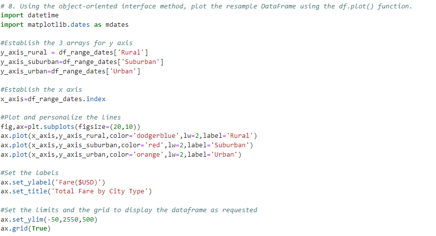

A legend was created to format and locate it as it was requested. The fontsize was set to 10 and 15 for the title.  

To stablish the ticks as months we used the __axis.set_major_locator()__ function in axis module of matplotlib library that is used to set the locator of the major ticker and then the __.MonthLocator()__ function that make ticks on occurrences of each month.  
Once the number for months were stablished [0 to 13] we format with the function __.DateFormatter('%b')__ to show the month as string in the ticks.

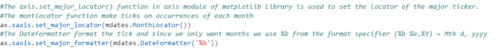

Finally style was imported from Matplotlib to give the 'fivethirtyeight' style to the chart. 
Save the result as PyBer_fare_summary.png and show the final chart.

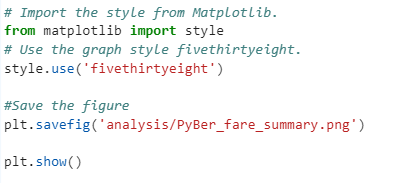

## Results

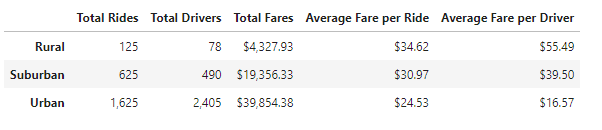

The results shows:
* The rural city type has the highest average fare per ride and per driver, the urban city type has the lowest average fare per ride and per driver, while the suburban is in between of them.
* The urban city has the highest amount of rides and the rural the lowest.
* Throughout the months the rural city type has a low demand on trips, while the urban has the highest demand on trips.
* By the end of February we can see a peak on the three city types, this could have happened because of an event or holiday.
* For rural and urban cities the demand by the end of April decreases, while for the suburban cities increase.

## Summary

Bussines recomendations:

1. Consider to start a bussiness strategy in rural cities to recruit more drivers, since the actual amount of driver only covers the 62% of rides from that area. This could be the reason why the prices for rural cities are higher against urban and suburban.
2. Consider starting a marketing campaing to encourage the use of Pyber in urban cities. The offer (amount of drivers) is 48% greater than the demand (total rides). This means that not all drivers are taking rides and therefore the fare is lower in comparisson with suburban and rural cities.
3. Start a study in rural cities to find out why the high fares and implement solutions for this. A reason could be the lack of drivers but also the distance of rides could have an impact on prices.
